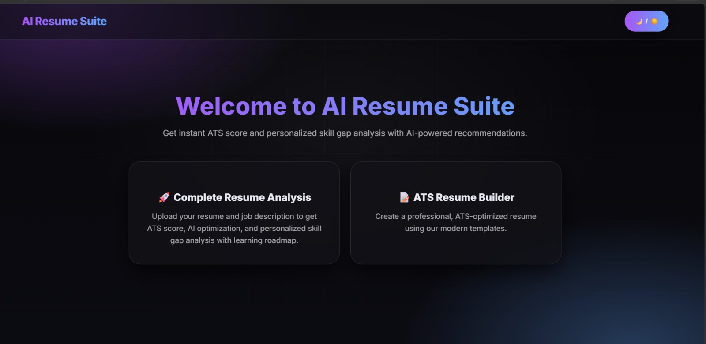

# AI Resume Evaluator

An AI-powered resume evaluation and optimization system built using NLP and machine learning techniques to analyze resumes, compare them with job descriptions, calculate ATS scores, and generate resume improvement suggestions.

The system uses transformer-based semantic similarity, keyword matching, and AI-driven optimization to improve resume-job matching accuracy and ATS compatibility.

---

## Features

- ATS score calculation
- Resume and job description comparison
- Semantic similarity analysis
- Keyword extraction and matching
- AI-powered resume optimization
- Missing skills identification
- Career roadmap generation
- PDF resume parsing
- Structured resume evaluation report
- ATS-friendly resume suggestions

---

## Technologies Used

### Backend
- Python
- Flask
- Sentence Transformers
- Scikit-learn
- PDFMiner

### Frontend
- HTML
- CSS
- JavaScript

### AI / NLP
- NLP Techniques
- Semantic Embeddings
- Cosine Similarity
- Large Language Models (LLMs)

---

## System Workflow

1. User uploads resume and enters job description
2. Resume text is extracted and preprocessed
3. Semantic embeddings are generated
4. ATS score is calculated using:
   - Semantic similarity
   - Keyword matching
5. AI module analyzes:
   - Missing skills
   - Resume formatting
   - ATS compatibility
6. System generates:
   - Resume improvement suggestions
   - Optimized resume content
   - Personalized career roadmap

---

## Project Structure

```bash
ai-resume-evaluator/
│
├── backend/
├── frontend/
├── static/
├── templates/
├── screenshots/
├── README.md
├── requirements.txt
└── .gitignore
```

---

## Installation

### Clone Repository

```bash
git clone https://github.com/your-username/ai-resume-evaluator.git
cd ai-resume-evaluator
```

### Install Dependencies

```bash
pip install -r requirements.txt
```

### Run Application

```bash
python app.py
```

---

## Screenshot



---

## Methodology

The project follows the following methodology:

- Resume PDF text extraction and preprocessing
- Semantic embedding generation
- ATS score calculation using cosine similarity
- Keyword matching and analysis
- AI-powered resume optimization
- Career roadmap generation

---

## Models Used

- SentenceTransformer (`all-mpnet-base-v2`)
- Cosine Similarity
- Large Language Models (LLMs)

---

## Future Enhancements

- Add real-time job recommendation system
- Support DOCX resume parsing
- Add authentication and user dashboard
- Improve ATS scoring with section-wise analysis
- Integrate recruiter-side candidate ranking
- Add multilingual resume support
- Deploy using AWS or Render
- Improve optimization using advanced LLMs
- Add downloadable ATS-friendly resume templates

---

## Authors

- Anoop H
- Athulkrishna M P
- Sinan Sha
- Sooraj S

### Guide
Ms. Shyma A  
Assistant Professor  
Department of Computer Science and Engineering  
College of Engineering and Management, Punnapra

---

## My Contributions

- Developed backend functionality using Flask
- Implemented ATS scoring and keyword matching
- Worked on semantic similarity analysis
- Integrated NLP-based resume evaluation
- Contributed to frontend development using HTML, CSS, and JavaScript

---

## Academic Project

This project was developed as part of the B.Tech Computer Science and Engineering curriculum.

---

## License

This project is intended for educational and academic purposes.